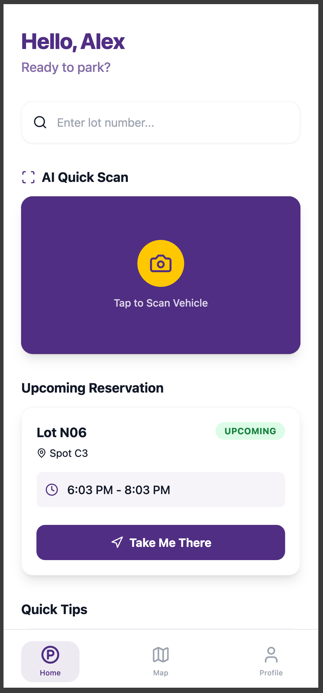
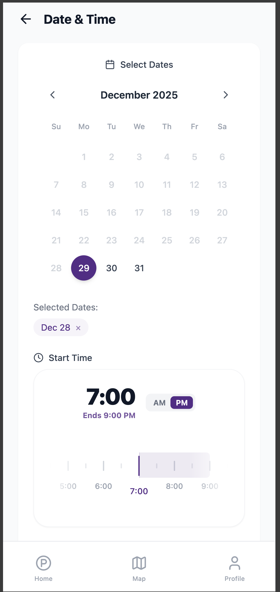
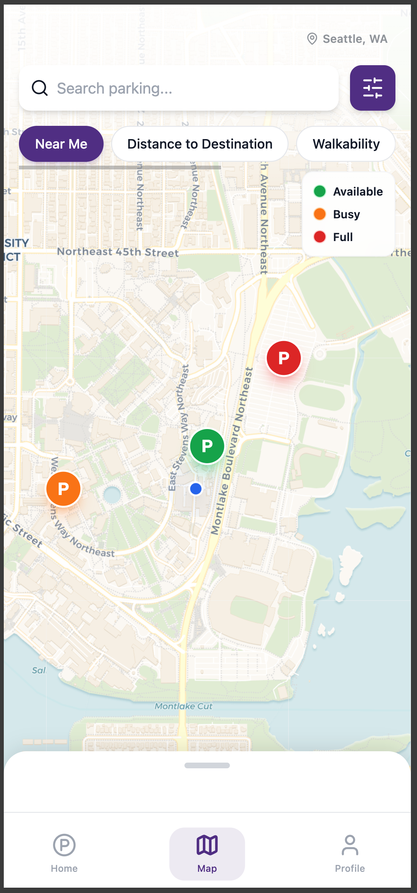
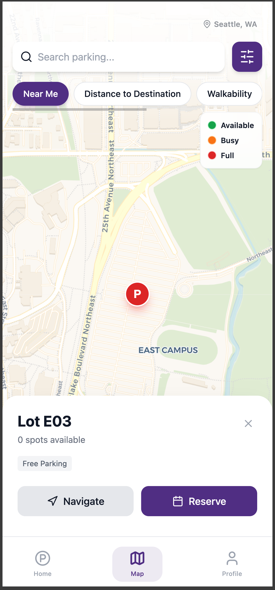

# AcuPark

Mobile-first campus parking web app.

## Features
- **AI Quick Scan**: Use camera to scan parking lots.
- **Real-time Map**: Find available spots.
- **Reservations**: Book spots in advance with an enhanced "Smart Zoom" timeline for precise time selection.
- **Smart Navigation**: Route guidance with "Anxiety Reducer".
- **Profile**: Manage vehicle and payment methods.

## Setup

1.  Install dependencies:
    ```bash
    npm config set strict-ssl false
    npm install
    ```

2.  Run the development server:
    ```bash
    npm run dev
    ```

3.  Open [http://localhost:3000](http://localhost:3000) with your browser.

## Mobile View
This app is optimized for mobile portrait mode. Use your browser's developer tools to simulate a mobile device (e.g., iPhone 12/14 Pro).

## Screenshots

| Home Screen | Reservation | Real-time Map | Navigation |
|:---:|:---:|:---:|:---:|
|  |  |  |  |

> **Note:** Please add screenshots to `public/screenshots/` named `home.png`, `reservation.png`, `map.png`, and `navigation.png`.
