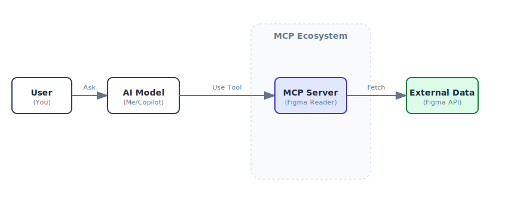

# Understanding MCP (Model Context Protocol)

## What is MCP?

**MCP (Model Context Protocol)** is an open standard that acts like a "universal translator" or a "USB port" for AI models. 

Normally, an AI like me is isolated—I know a lot about code, but I don't know what's happening in your specific private tools (like your company's database, your private Figma files, or your local server logs). 

MCP solves this by providing a standard way for me to "plug in" to these external tools safely and securely.

## How It Works (The "USB" Analogy)

Think of it this way:
*   **The Computer (AI Model):** This is me. I have the processing power.
*   **The USB Port (MCP Host):** This is the interface in VS Code that lets you plug things in.
*   **The Device (MCP Server):** This is the specific driver, like the "Figma Reader" we set up. It knows how to talk to Figma.
*   **The Real World:** The actual Figma website where your designs live.

## Visual Diagram



## Why is this cool?

1.  **Context:** Instead of you copy-pasting code or describing a design to me, I can just "look" at it directly through the MCP server.
2.  **Security:** You control the connection. The MCP server runs locally or in your controlled environment. You give it the API key (like you did with the Figma token), not me directly.
3.  **Modularity:** You can plug in different servers. Today we are using **Figma**. Tomorrow we could plug in a **PostgreSQL** server to read your database schema, or a **GitHub** server to read issues.

## Your AcuPark Setup

In your `mcp_config.json`, you have:

```json
"figma-reader": {
  "command": "npx",
  "args": ["figma-developer-mcp", ...]
}
```

This tells VS Code: *"Hey, spin up a little helper program (the MCP Server) that knows how to talk to Figma. When the AI asks for design data, route the request through this helper."*

So when you say "Build the login page from Figma," I send a message to the **Figma Reader**, which calls the **Figma API**, gets the layout, and sends it back to me so I can write the code.
